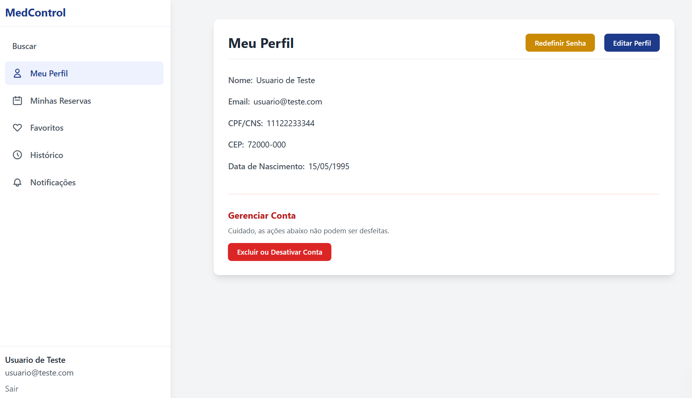
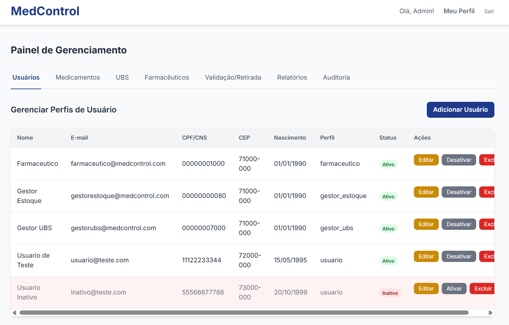

# **🏥 MedControl \- Sistema de Monitorização de Medicamentos (UBS/DF)**

O **MedControl** é uma plataforma Full Stack concebida para gerir e monitorizar a disponibilidade de medicamentos nas Unidades Básicas de Saúde (UBS) do Distrito Federal. O sistema visa solucionar a falta de transparência no stock público, permitindo que cidadãos consultem a disponibilidade em tempo real e realizem reservas, otimizando o fluxo nas unidades de saúde.

## **🚀 Tecnologias e Ferramentas**

O projeto foi construído utilizando uma arquitetura robusta e moderna:

* **Backend:** Java 21 com o framework **Javalin** (API REST leve e de alto desempenho).  
* **Segurança:** Implementação de **Spring Security** (BCrypt) para a criptografia de palavras-passe e controlo de acessos.  
* **Base de Dados:** MySQL para a persistência de dados críticos.  
* **Gestão de Dependências:** Maven.  
* **Integrações de API:**  
  * **Google Gmail API:** Envio automático de confirmações de reserva.  
  * **ViaCEP:** Localização automática de endereços para utilizadores e unidades.  
  * **Hunter API:** Verificação e validação de e-mails em tempo real.  
* **Frontend:** Interface responsiva desenvolvida com HTML5, CSS3 e JavaScript (Vanilla).

## **🛠️ Funcionalidades Principais**

O sistema contempla as necessidades de diferentes perfis de utilizadores (RBAC):

### **Para o Cidadão**

* **Busca por Geolocalização:** Encontrar a UBS mais próxima com o medicamento em stock.  
* **Reserva de Medicamentos:** Garantir a reserva do fármaco antes de se deslocar à unidade.  
* **Perfil Personalizado:** Gestão de dados e histórico de retiradas.

### **Para a Gestão de Saúde (Farmacêuticos e Admin)**

* **Controlo de Inventário:** Gestão rigorosa por lote e data de validade (prevenindo desperdícios).  
* **Registo de Retiradas:** Vinculação de receitas médicas às entregas realizadas.  
* **Auditoria de Sistema:** Log detalhado de todas as operações críticas para garantir a integridade dos dados.  
* **Relatórios Estratégicos:** Visão geral da procura e stock crítico.

## **📐 Decisões de Arquitetura**

A escolha do **Javalin** em detrimento de frameworks mais pesados permitiu um controlo total sobre as rotas e o comportamento da API, resultando numa aplicação mais leve e de fácil manutenção. A estrutura de pastas segue o padrão Maven, separando claramente as responsabilidades de controladores, serviços e acesso a dados (DAO/DB).

## **📸 Demonstração do Sistema**

## 📸 Demonstração do Sistema

### Ecrã Inicial e Busca

*Interface principal onde os Usuarios e Admins fazem seu login.*

*Interface principal onde o cidadão pesquisa medicamentos por geolocalização.*

### Gestão (Admin)

*Painel restrito para os ADMINISTRADORES gerirem.*

**Adicione aqui imagens do seu projeto\!**

Sugestão: Captura de ecrã da Home, do Painel de Stock e da Tela de Reserva.

## **🔧 Como Executar o Projeto**

1. **Base de Dados:** Execute o ficheiro database/schema.sql no seu servidor MySQL.  
2. **Configuração:** Atualize as credenciais de acesso à base de dados no ficheiro backend/src/main/java/br/com/medcontrol/db/DB.java.  
3. **Google API:** Certifique-se de que o ficheiro credentials.json está na raiz da pasta backend para o funcionamento do serviço de e-mail. (Não é necessário para visualizar, a menos que queira um teste com E-MAIL real)
4. **Backend:** No VS Code, abra a pasta backend e execute o ficheiro ApiServer.java.  
5. **Frontend:** Utilize a extensão *Live Server* para abrir o ficheiro frontend/pages/Home.html.

## **👥 Equipe de Desenvolvimento**

Projeto desenvolvido na disciplina de **Laboratório de Inovação III** do **Senac**, sob orientação do **Prof. MSc. Edilberto M. Silva**.

* **Victoria Ferreira** (Desenvolvedora Principal / Full Stack)  
* Equipe: Bruno Nogueira, Iuri Carvalho, Kauã Oliveira, Leonardo Oliveira, Luis Otávio, Warley Kerlon.

© 2025 MedControl \- Tecnologia ao serviço da Saúde Pública.